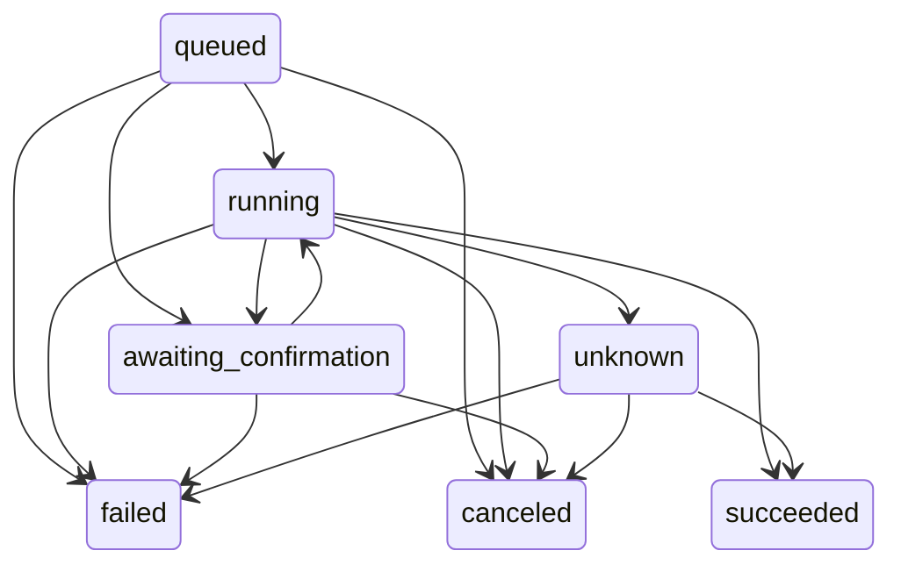

# Connector events and task-result notifications

`backend/app/services/connector_events.py` is Luma's application contract for
connector results. It does not add an MCP protocol feature or a transport.
It provides a callable service, strict source and owner boundaries, versioned
state transitions, UUID deduplication, and a bridge to the existing durable
notifications service. There is no new public ingestion route or migration,
and it is not enabled automatically at application startup.

## Required adapter and persistence boundaries

An adapter authenticates the connector credential, resolves the registered
connection and current connection version, and constructs `ConnectorBinding`
from server-owned `source`, `connector_id`, `connection_id`, `owner_id` and
`tenant_id`. Never construct it from a model tool argument, unverified webhook,
browser body, or tool-returned instruction. Resolve the owner and tenant again
when reading results or acknowledging a notification. The identity of the
connector connection, rather than a display name or an employee number, owns
its results. Authentication, replay protection for transport credentials,
permission revocation, rate limits and signature verification remain the
private adapter's responsibility.

The service requires a `ConnectorEventStore`. Its transaction must:

- Serialize writers for the complete binding scope and task ID.
- Enforce a **global unique event UUID** and look it up across scopes. Reusing
  an ID with another scope is forbidden; changed content in one scope conflicts.
- Store only the normalized fingerprint, scope and safe receipt in its ledger,
  plus the bounded task projection. Do not store the original tool result.
- Commit receipts, task projections and notifications through the same database
  transaction. Return from the transaction context only after commit; roll back
  all three on failure. In PostgreSQL this normally uses task row/advisory locks
  and a unique event ID constraint. Concurrent first events need serialization
  before the initial task row exists.
- Scope task lookups and writes by every binding field, with no fallback to an
  owner-only, connector-only or unscoped lookup. Keep the deduplication ledger
  independent of the user-editable and deletable inbox.

`ConnectorEventTransaction.connection` is the existing notifications database
connection. Its `get_receipt`, `put_receipt`, `get_task` and `put_task` methods
form the persistence seam. The example SQLite store in
`backend/tests/test_connector_events.py` exercises this contract in an isolated
temporary database; it is not a production store or an application dependency.
Production must supply a durable store and adapter before enabling ingestion.
No production reliability or external delivery is claimed by the test adapter.

## Envelope and state meanings

Every event includes `schema_version: 1`, a UUID `event_id`, a UUID `task_id`,
an aware ISO-8601 `occurred_at`, `kind`, all five binding fields, and a positive
`connection_version`. The scope and connection version must match the verified
binding. Timestamps normalize to UTC before fingerprinting; the transport must
separately enforce its replay/freshness policy. Unknown fields are rejected.

| Kind | Fields | Meaning |
| --- | --- | --- |
| `task.state` | `version`, `status`, optional opaque `result_ref` or `error_code` | The authenticated source's execution status, not approval or business resolution |
| `business.state` | `business_version`, `business_status`, opaque `business_ref` | A separately versioned source business entity, independent of execution and notification ACKs |
| `delivery.ack` | `notification_id`, `ack: delivered` or `read` | A separate delivery or user read receipt for an inbox row created for this task |

Task states start at `queued`, version 1, and advance exactly one version:



`succeeded`, `failed` and `canceled` are terminal. Reconciliation may resolve
`unknown` using the existing provider request/result; it cannot restart the
action with a new event. A `succeeded` event must contain an opaque source
`result_ref`. The trusted adapter must verify the actual provider response
before emitting it. This reference is not independently verified by Luma's
generic service. A model completion, HTTP timeout or client-observed UI state
cannot establish success. Confirmation and idempotent business execution belong
to the execution adapter; merely emitting `awaiting_confirmation` does not
implement a consent interface or authorize an external write.

Business states start at `pending`, version 1, then move to `in_progress`,
`resolved` or `rejected`; `in_progress` can move to `resolved` or `rejected`.
Terminal business states cannot restart, and the business reference is immutable
within a task. They do not alter the task state. Private adapters can translate
their native status vocabulary into this intentionally small contract.

For a read ACK, pass an `OwnerAcknowledgement` derived from a separately
authenticated user request. A connector credential alone cannot mark a row read.
Delivery ACKs require a verified connector receipt. Both ACKs check the row's
owner and its association in the authoritative task projection. They set
independent timestamps: a read ACK does not invent a provider delivery receipt,
and a delivery ACK does not set the inbox's `read_at`. Neither resolves a task
or a source business entity. A duplicate event returns its original receipt.

## Bridge to the existing inbox

`NotificationBridge` calls `create_notification(..., conn=tx.connection,
publish=False)`, records the task/event/version metadata in that same
transaction, and the service calls `publish_notification` after commit.
The existing `/api/v1/notifications` owner-scoped listing, SSE resume and read
endpoints remain available. When integrating an existing inbox read endpoint,
the adapter should additionally emit the authenticated read ACK; the generic
service does not automatically intercept that endpoint.

Only `awaiting_confirmation`, `succeeded`, `failed`, `canceled` and `unknown`
task transitions create an inbox notification. Its title/body are fixed status
templates. Metadata contains event/task UUIDs, state and version. No free-text
summary, sensitive reason, tool arguments, raw response, source result text,
temporary URL or credential is accepted or copied into the notification or
logged by this service. Read detailed results through the source adapter after
checking owner, tenant and current permissions. Treat those results as
untrusted data; they never change a binding or grant permissions.

Publishing is best effort. The committed row is the durable inbox/SSE boundary;
it does not prove mobile push, IM delivery, read, reply, approval or resolution.
Replaying a UUID does not create a row or republish, even if the user deleted
the notification. Reliable external delivery needs a private provider adapter
with a transactional outbox, stable provider idempotency key and reconciliation
by the original request ID. This module does not implement IM, group chat,
presence leases, audio/video transport, media credentials or call UI.

## Callable example

All identifiers below are synthetic. `production_store` and the binding are
resolved by the host application's trusted adapter:

```python
from app.services.connector_events import ConnectorBinding, ConnectorEventService

binding = ConnectorBinding(
    source="connector-runtime", connector_id="sample-connector",
    connection_id="connection-1", owner_id="owner-1", tenant_id="tenant-1",
)
service = ConnectorEventService(production_store)
receipt = service.ingest(binding, {
    **binding.scope(), "connection_version": 1, "schema_version": 1,
    "event_id": "49a5d5f1-a00b-4ef9-8a3f-6a72a9a70faa",
    "task_id": "b5f17148-bc6a-4f0e-a411-891b38cc91d7",
    "kind": "task.state", "occurred_at": "2026-10-08T00:00:00Z",
    "version": 1, "status": "queued",
})
```

Emit the next version with a fresh event UUID for each real state change. Retry
the same canonical event and UUID on transport failure; changed content with
the same ID is a conflict. The service does not execute the tool, approve a
form, or infer the missing provider outcome.

Run the isolated verification after implementation:

```sh
cd backend
python -m unittest tests.test_connector_events -v
```

Coverage includes owner/source/tenant isolation, timezone-normalized dedupe,
version and transition rejection, unknown-result reconciliation, independent
business/delivery/read states, real notification INSERTs, transactional rollback,
concurrent worker replay, restart persistence, editable/deleted inbox rows and
post-commit publish failure. These checks use synthetic data and make no network
or business database requests.
